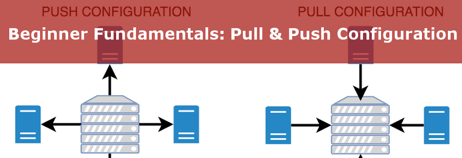

Here is a breakdown of the exact fraction of a second when the Puppet Master acts as the "kitchen" and prints that receipt.
Step 1: The Agent hands over its ID (Facts)

When the server (web-server-01) wakes up, it doesn't just ask for a catalog. It sends a highly detailed payload of data gathered by Facter.
It essentially says: "Hi, I am web-server-01. I am running Ubuntu. I have 8GB of RAM. My IP is 10.0.0.5."
Step 2: The Master checks the "Menu" (Node Classification)

The Puppet Master receives this data and opens your main Manifest file. It scans through all the code for your entire company to find the specific block assigned to web-server-01.

It finds a block that looks like this:
Puppet

node 'web-server-01' {
  include nginx
}

Now the Master knows it only needs to look at the nginx instructions. It completely ignores the code for the database servers, the monitoring servers, and the backup servers.
Step 3: The Master does the thinking (Compilation)

The Master reads your nginx code. Let's say your code has some logic in it:
Puppet

if $facts['os']['name'] == 'Ubuntu' {
  $package_name = 'nginx-core'
} else {
  $package_name = 'nginx-mainline'
}

The Master looks at the Facts it received in Step 1. It sees the OS is Ubuntu. It solves the logic right then and there. It permanently assigns nginx-core as the package and throws away the else block entirely.
Step 4: The Receipt is printed (The Catalog)

The Master takes that resolved logic and generates a JSON-like document. This is the Catalog.

The Catalog contains zero logic. There are no variables, no if/else statements, and no references to other operating systems. It is stripped down to a pure, static checklist:

    Package nginx-core MUST be installed.

    Service nginx MUST be running.

    File /var/www/html/index.html MUST exist.

Why do it this way?

The Puppet Agent installed on your server is intentionally "dumb." It does not know how to evaluate complex code or make decisions.

By compiling the Manifest into a Catalog using the server's specific Facts, the Master does 100% of the thinking. It hands the Agent a perfectly clear, static receipt that requires zero decision-making to execute—the Agent just reads the list and makes it happen.

Push Architecture (The Commander)In a Push model (e.g., Ansible), the central server acts like a commander giving orders. It connects to the target machines and forces them to execute commands.Who starts the conversation? The Central Server (Master).The Flow: The engineer types a command on their laptop or the Master server. The Master opens an SSH connection to Node 1, pushes the configuration, closes the connection, then moves to Node 2, and so on.Best Used For: Rapid deployments, ad-hoc tasks (like restarting a service across a fleet), and initial server provisioning where you want immediate execution.Advantages of PushNo Agents Required: Because it usually relies on standard SSH (or WinRM for Windows), you don't need to install any background "Agent" software on your 10,000 servers.Immediate Execution: If you hit "Enter" right now, the configuration starts applying right now. You don't have to wait 30 minutes for a server to check in.Complete Control: The central server dictates exactly when changes happen, making it easy to orchestrate complex, multi-tier deployments (e.g., "Update the database first, then update the web servers").Disadvantages of PushThe Firewall Problem: The central server needs incoming access to every single node. If a node is behind a strict firewall or NAT, the Master cannot reach it.The Offline Problem: If Node 500 is offline when you push the update, it misses the update entirely. The engineer has to manually remember to re-push the configuration when Node 500 comes back online.Scalability Bottleneck: Pushing configurations to 10,000 servers simultaneously requires immense network bandwidth and processing power from the Master.Pull Architecture (The Billboard)In a Pull model (e.g., Puppet, Chef), the central server acts like a billboard. It simply hosts the desired configurations, and the nodes check the billboard on their own schedule.Who starts the conversation? The Target Node (Agent).The Flow: Node 1 wakes up (e.g., every 30 minutes), reaches out to the Master, says "Here is who I am, what should I look like?", downloads its Catalog, and applies the changes locally.Best Used For: Enforcing strict compliance, massive-scale infrastructure, and environments where nodes frequently go offline or scale up/down automatically.Advantages of PullSelf-Healing (The Offline Solution): If Node 500 is offline when you update the code, it doesn't matter. The moment it powers back on, the Agent wakes up, checks in, and pulls the new configuration automatically.Firewall Friendly: The Master does not need to connect to the Agents. The Agents initiate an outbound connection (usually over standard HTTPS port 443) to the Master. Most corporate firewalls allow outbound traffic by default.Massive Scalability: The Master isn't tracking 10,000 active SSH sessions. It simply waits for staggered HTTP requests. If you add 5,000 new servers tomorrow, you don't configure the Master; the new servers just start polling.Disadvantages of PullAgent Overhead: Every target machine must have the proprietary Agent software installed and running constantly in the background.Delayed Execution: If you push an emergency security patch to the Master at 2:05 PM, you have to wait for the Agents' scheduled run (e.g., 2:30 PM) for the patch to apply to the whole fleet.Harder to Orchestrate: Because nodes check in independently, it is very difficult to coordinate a deployment where Server A must finish its task before Server B starts its task.

Q)Explain the concept of Idempotency and how the Puppet Agent uses it when applying a Catalog.
Soln. Idempotency is arguably the most important concept in all of Infrastructure as Code (IaC) and configuration management.

In pure computer science terms, an operation is idempotent if doing it once has the exact same result as doing it 1,000 times.

If you understand idempotency, you understand exactly why Puppet is infinitely safer than writing Bash scripts.
The Problem with Scripts (Not Idempotent)

Imagine you write a simple Bash script to set up a web server. It contains this command:
Bash

mkdir /var/www/mywebsite

    Run 1: The script creates the directory. Success.

    Run 2: The script tries to create the directory again. It crashes and throws an error: mkdir: cannot create directory: File exists.

Because the script crashed on step 1, steps 2 through 10 never execute. To fix this, you have to write complex logic into your script: "Check if the folder exists, and if it doesn't, create it." Now imagine writing that error-handling logic for 500 different configurations.
The Puppet Solution (Idempotent)

Puppet does not run commands. Puppet enforces a state.

When the Puppet Server sends the Catalog to the Agent, the Agent treats it like a checklist of desired states. Before it touches anything, it compares the Catalog to reality.

Suppose your Catalog says:
Puppet

file { '/var/www/mywebsite':
  ensure => 'directory',
}

Here is exactly how the Puppet Agent processes this using idempotency:

Run 1 (Brand New Server):

    Check: Does /var/www/mywebsite exist? -> No.

    Action: Create the directory.

    Report: State changed from 'absent' to 'directory'.

Run 2 (Thirty Minutes Later):

    Check: Does /var/www/mywebsite exist? -> Yes.

    Action: Do absolutely nothing.

    Report: State unchanged.

Run 3 (A developer accidentally deletes the folder):

    Check: Does /var/www/mywebsite exist? -> No.

    Action: Re-create the directory.

    Report: State changed from 'absent' to 'directory'.

The Thermostat Analogy

The best way to think about an idempotent Puppet Agent is to think of the thermostat in your house.

    You don't tell a thermostat: "Turn on the AC and blast cold air for 30 minutes." (That's a script).

    You tell a thermostat: "The temperature must be 72 degrees." (That's declarative configuration).

If the room is 80 degrees, the thermostat turns on the AC. If the room is exactly 72 degrees, it does nothing. If you walk over to the thermostat and set it to 72 degrees 50 times in a row, the house doesn't freeze—it just stays at 72.

Because Puppet is idempotent, the Agent can wake up every 30 minutes, evaluate its Catalog containing hundreds of instructions, and safely run them over and over again without ever breaking the server. It only acts when the server drifts from the blueprint.
