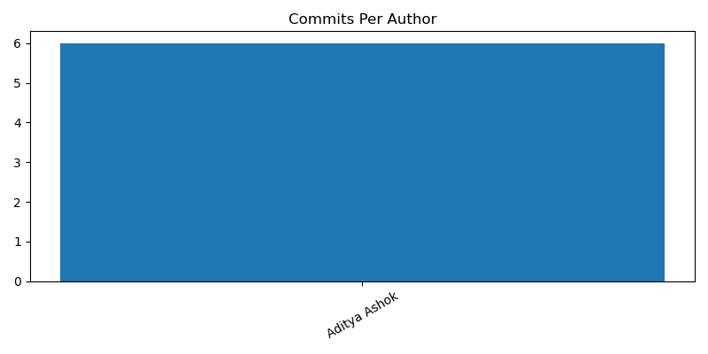
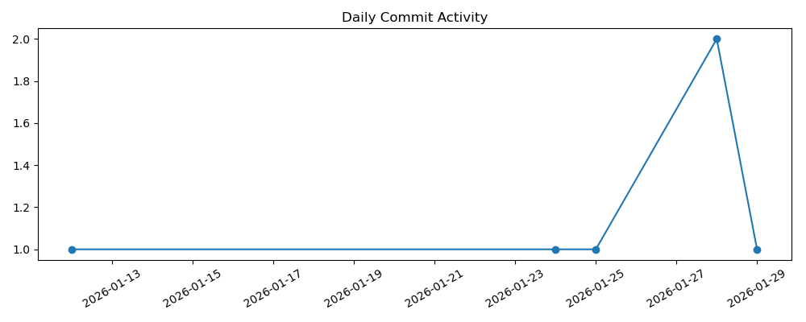

# Git Repository Analysis Report
Generated on: Mon Feb  9 13:14:23 UTC 2026

## Summary
- Total Commits: 6
- Commits last 7 days: 0
- Commits last 30 days: 6

## Commits Per Author
     6	Aditya Ashok

## Code Changes
- Lines Added: 3638
- Lines Removed: 19

## Most Modified Files
      3 Docker/Readme.md
      2 Docker/interactive-mode/myapp.py
      2 Docker/interactive-mode/Dockerfile
      2 Docker/demo/src/App.jsx
      1 yaml/school.yml
      1 yaml/school.xml
      1 yaml/school.json
      1 yaml/hello.yaml
      1 yaml/datatypes.yml
      1 yaml/advanceDatatype.yml

## Stale Branches

## Charts
### Commits Per Author

### Daily Commit Activity

